# llmhub

Local, OpenAI-compatible gateway that routes chat completions across free vendor API
tiers instead of one hardcoded provider. It tracks quota per (account, model) in SQLite,
picks whichever free candidate still has room, and falls back to a job queue when nothing
does. Policy is fixed: free endpoints only, a paid model is never selected automatically.

**Status**: personal project, run on one Mac for the owner's own use. Free-only by
design, alpha quality, the API can still change between versions. Issues and PRs are
welcome, response time is best-effort. Not affiliated with, endorsed by, or sponsored by
any of the LLM vendors it talks to.

## Why

Free LLM tiers come with per-model windows (hourly, daily, monthly, or a one-time
allowance) that reset on their own schedules and vary vendor to vendor. Calling one
vendor directly means either burning through its window and hitting a wall, or manually
juggling multiple SDKs and keys across projects. llmhub is one process that: rotates
across accounts and vendors as windows run dry, refuses to fall back to a paid model
without an explicit opt-in, and records every call so usage is visible instead of
guessed at.

## Architecture

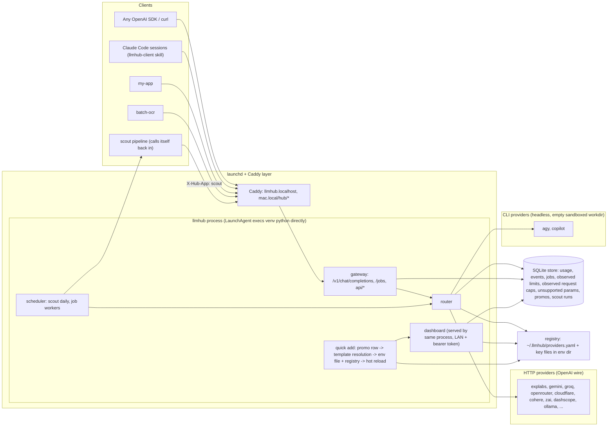

See [`docs/ARCHITECTURE.md`](docs/ARCHITECTURE.md) for the request-lifecycle
(selection filters, retry/fallback rules, the `/jobs` state machine) and
scout-pipeline diagrams.

## Quick start

```bash
cd ~/llmhub
uv sync
uv run python -m llmhub --host 127.0.0.1 --port 8800
```

Python 3.12+. First start copies `providers.example.yaml` to `~/.llmhub/providers.yaml`
and creates `~/.llmhub/hub.db`. Put provider keys in `~/.llmhub/env/<provider>.env` before
starting, or add them later from the dashboard.

First request:

```bash
curl http://127.0.0.1:8800/v1/chat/completions \
  -H 'Content-Type: application/json' \
  -H 'X-Hub-App: myapp' \
  -d '{"model":"auto","messages":[{"role":"user","content":"Say OK."}]}'
```

`X-Hub-App` is required on every gateway call - it is how usage, pausing and the Usage
tab attribute a request to a project.

Dashboard: `http://127.0.0.1:8800/` directly, or `http://llmhub.localhost/` once Caddy is
set up (see "Running as a service" below).

## How routing works

`model` in the request body is either an alias or an explicit `provider/model_id`:

- `auto` - text-first alias, tries free candidates in registry preference order.
- `vision` - alias that requires the `vision` capability.
- `fast` - alias tuned for low-latency text replies.
- `strong` - alias for the highest-quality free models (antigravity's thinking models,
  explabs), spread over a small pool since there are few of them.
- `local` - alias that prefers models running on local Ollama, no vendor call at all.
- `extract` - alias for long inputs and strict JSON: a 24000-token context floor, no
  reasoning models, nothing measured slower than 30 s.
- `provider/model_id` (e.g. `zai/glm-4.5-flash`) - pins one vendor directly.

On top of the alias:

- `X-Hub-Require: vision,json` - capability filter (comma list), narrows the candidate
  pool without hardcoding a model id.
- `X-Hub-Prefer: provider/model` - soft preference, moves that candidate first.
- `X-Hub-Min-Context: 24000` - requirement: the model's declared context must be known and
  at least this wide. `X-Hub-Avoid: reasoning` (caps) and `X-Hub-Max-Latency-Ms: 30000` are
  preferences - they push a candidate down the order, never out of the pool. The same three
  can sit on an alias (`min_context`, `avoid`, `max_latency_ms`); alias and header combine to
  the stricter side, and the 429 body echoes the result under `error.constraints`.
- `X-Hub-Allow-Paid: 1` - the only way a non-free model becomes eligible. Default: never.

An app can also ban a model for itself: `POST api/apps/{app}/bans {model, reason}` (the
reason is mandatory) keeps that pair out of that app's pool until
`DELETE api/apps/{app}/bans/{model}`. That is for quality the hub cannot measure and the app
can - paraphrasing instead of quoting, ignoring a schema - not for transient errors, which
the router already handles.

Each model in the registry declares a free quota shape - `hourly`, `daily`, `monthly`
windows that reset on schedule, or a fixed `allowance` that never refills and only ends
at an `expires_at` date or a manual `forgive`. Windows are tracked per (account, model),
so a second account on the same provider is rotation, not a shared budget. Most free
tiers publish no numbers up front: a window's limit starts unknown and becomes an
**observed cap** the first time a 429 states one, so a model is not treated as unlimited
forever just because the yaml says nothing. A window caps requests as readily as tokens -
the metric is whatever the vendor's own error named, never assumed - and a per-minute limit
is a retry, not a window.

An alias like `auto` fans requests across candidates rather than walking `prefer` in a
strict line: `spread: N` (default 4 for `auto`/`vision`/`fast`/`strong`, 1 elsewhere)
picks the least-recently-used of the top N eligible candidates, so a wide pool actually
gets used instead of parking every call on the first entry until it 429s. `X-Hub-Prefer`
still wins outright and goes first.

A vendor error is classified against a per-provider signal table (`vendor_errors.py`,
documented in `docs/DESIGN.md`), and no vendor failure escapes the run: `quota` marks that
(account, model) exhausted until its window resets (or until `forgive`/`expires_at` for an
allowance); `retry` gets one short retry, or a cooldown of exactly the delay the vendor
named when that is longer than the call can afford; `not_found` (an unusable route) and
`unavailable` (the provider's own upstream down behind a 4xx) park the pair for 7 days and
10 minutes respectively; a bare `error` moves to the next candidate, because one vendor's
opinion of a request is not the truth for the next one. A sync or stream call also carries a
wall-clock budget (`LLMHUB_RUN_BUDGET_S`, 90 s) so a wide pool cannot outlive the caller.

When no eligible candidate has quota, the gateway answers `429` with
`{"error": {"type": "no_candidates", "rejected": [...], "next_window_at": ...,
"remaining_out": ..., "remaining_in": ...}}` and headers `Retry-After`,
`X-Hub-Next-Window`, `X-Hub-Remaining-Out`/`X-Hub-Remaining-In`. `remaining_out` is the
best case across quota-rejected candidates: if it is greater than zero, retry once with a
smaller `max_tokens` instead of looping on the same request.

### Opt-in-only providers

An alias's candidate pool is the whole registry by default - `prefer` only ranks it, so
an entry nobody preferred is still tried once everything ahead of it is exhausted. That
is wrong for capacity that is metered or licensed rather than simply free: nothing should
spend it on a request that did not ask for it. `opt_in_only: true` on a provider block (a
single model can override it) removes that entry from every alias pool. It stays
reachable two ways: an explicit `provider/model_id` request, or an alias whose own
`prefer` list names it by hand. GitHub Copilot CLI ships this way (see below); a rejected
entry shows up in the 429 body with reason `opt_in_only`.

### Request size awareness

Every candidate carries an effective input ceiling - the smallest of its declared
`max_request_tokens`, its `context` window minus the requested output, and any ceiling
learned from a previous 413. A request too large for a candidate is rejected with reason
`too_large` instead of being sent and failing upstream; when nothing fits, the hub
answers `413` (see the error table below) instead of `429`, because waiting for a quota
window will not help. Declared ceilings are seeded from what a vendor documents (for
example groq's 8000 tokens/minute on its free tier); an unknown ceiling never rejects a
candidate on its own, so this cannot turn into a silent capacity cutoff.

A response that comes back with `finish_reason: length` while the caller asked for a
`response_format` json object is a broken result, not a short one - the JSON never
closes. That attempt counts as failed, the router moves to the next candidate, and a
`truncated` event is recorded against the model that did it.

## Client-facing errors

| Status | Meaning | Notes |
| --- | --- | --- |
| 400 | Bad request | malformed JSON body, missing `X-Hub-App` header, an unknown model/alias, or every vendor rejected the request itself (last vendor body passed through) |
| 401 | Unauthorized | missing or wrong bearer token on a non-loopback call |
| 413 | Request too large | no eligible candidate's input ceiling fits the request; body carries `error.max_request_tokens`, header `X-Hub-Max-Request` |
| 429 | No quota | every eligible candidate is exhausted; body carries `remaining_out`/`remaining_in` and `next_window_at`, headers `Retry-After`/`X-Hub-Next-Window` |
| 502 | Upstream failure | every candidate failed in turn; body carries `attempts`, the last vendor body under `last`, and `budget_exhausted` when the run stopped at its time budget |

## Adding a key

From the dashboard: **Accounts -> Quick add** - paste the key, say where it is from
(a URL, a vendor name, or a pasted sentence), hit Add. The hub matches a provider
template, writes the env line, discovers models if the template ships none, and runs one
`max_tokens: 1` test call.

From **Promos -> Add key**: same flow, seeded from a promo row (source and provider
already known).

Same thing over curl:

```bash
curl -X POST http://127.0.0.1:8800/api/accounts/quick \
  -H 'content-type: application/json' \
  -d '{"api_key":"REPLACE_ME","source":"https://console.groq.com/keys"}'
```

Unknown provider: the hub guesses `api.<domain>/v1` from the url and verifies it with your
key before registering anything.

Two templates matching equally, or nothing recognizable, gets a `422` with `needs` and a
`guess` list instead of guessing wrong. When endpoints were tried, the body also carries
`guesses` - each candidate url with what it answered.

A model registered without a `context` routes fine but cannot be sized against
`min_context` or `Entry.input_ceiling`; `python -m llmhub refresh-context [--dry-run]
[--provider NAME]` re-fetches each provider's own listing and fills it in wherever the
vendor named one and the model had none, without touching a context the owner already set.

## CLI providers

Some free paths are not an HTTP API but an agent CLI with a headless print mode. A
`kind: cli` provider is one such program; the hub runs it per request and maps the answer
back to a `chat.completion`, so clients see a normal model key. Shipped templates:
`antigravity` (Google Antigravity, command `agy`) and `copilot` (GitHub Copilot CLI, see
below). Each one gets a `CliDialect` - the argv it takes and the output it prints - chosen by
the provider block's `template`.

```yaml
  antigravity:
    kind: cli
    command: agy               # absolute path also accepted; ~/.local/bin is searched
    concurrency: 2             # per (account, model) semaphore
    timeout_s: 240             # also becomes the CLI's own --print-timeout
    workdir: ~/.llmhub/cli-work/antigravity   # default; created empty, used as cwd
    env_passthrough: [HOME, PATH, LANG]
    accounts:
      - {id: antigravity-main, api_key_env: null}
    models:
      - {id: claude-opus-4-6-thinking, caps: [text, json, reasoning], free: {}}
```

Add it from the dashboard with **Quick add** and no key at all:

```bash
curl -X POST http://127.0.0.1:8800/api/accounts/quick \
  -H 'content-type: application/json' -d '{"source":"antigravity"}'
```

The login lives in the CLI's own config, so `python -m llmhub check` prints `cli` in the
KEY column instead of yes/no, and a lost session shows up as an `auth` event telling you to
run the CLI in a terminal and sign in. `POST api/providers/antigravity/discover` runs
`agy models` and returns the ids.

Mapping and limits: the chat request is flattened into one prompt (system messages first,
then `User:`/`Assistant:` turns), `response_format: json_schema` becomes a schema file
handed to the CLI, `json_object` becomes one instruction line, and `max_tokens` and
`temperature` are ignored - the CLI has no flags for them. Image parts are a `400`: caps
are `[text, json, reasoning]`, so `X-Hub-Require: vision` never picks a CLI. Streaming
requests get the whole answer as one chunk plus `[DONE]`; there is no token stream to pass
through. Reasoning tokens land in `usage.completion_tokens_details.reasoning_tokens`.
Expect a few thousand input tokens of agent system prompt per call.

Security posture: the process runs with `--sandbox` in an empty working directory (never a
source tree - the hub refuses a workdir holding `.git` or `pyproject.toml`), gets only the
environment variables listed in `env_passthrough` (so no API keys), is started with
`create_subprocess_exec` rather than a shell, and is killed by process group on timeout.
`--dangerously-skip-permissions` is never passed.

### Copilot CLI

`copilot` (GitHub Copilot CLI, npm `@github/copilot`) is the second shipped template. Log in
once in a terminal - `copilot login`, or `/login` inside an interactive session - with the
account that holds the licence; there is no key to paste, and `POST
api/providers/copilot/discover` answers `400` because the CLI has no model listing (the ids
come from the template). Quick add takes no key either:

```bash
curl -X POST http://127.0.0.1:8800/api/accounts/quick \
  -H 'content-type: application/json' -d '{"source":"copilot"}'
```

**The Copilot seat is not the owner's to spend freely, hence opt-in only per call**: the
provider block carries `opt_in_only: true`, which removes every `copilot/*` model from
`auto`, `vision`, `fast`, `strong` and `local` outright - not just a low `prefer` ranking, so
it is never reached as a last-resort fallback either. It is meant to be reached as an
explicit `copilot/<model>` or through its own `copilot` alias (which names six of its models
in `prefer`). The seat holder sees the usage and the audit log of every call, so nothing
private-project belongs here.

Cost floor: every call, however short the prompt, costs about a third of a premium
request (measured ~0.33), because the CLI always sends its own ~8.2k tokens of tool
definitions along with the prompt. `--deny-tool` (used to fence the CLI, see below) blocks
the model from calling those tools but does not remove their schemas from what gets sent,
so it has no effect on this floor.

Differences from the antigravity dialect, all handled in `cli_backend.py`: output is JSONL
(one event object per line, the answer in the last `assistant.message`), tokens and cost come
from the session's own counters (input tokens only - the CLI reports no output count - plus
AI credits and premium requests in `hub_cli`), `response_format: json_schema` becomes an
instruction line in the prompt because there is no schema flag, and `max_ai_credits` per
model becomes `--max-ai-credits` so one runaway call cannot drain a monthly allowance.
Non-interactive mode requires `--allow-all-tools`, so every call is fenced instead:
`--deny-tool` for shell/write/edit/fetch, no MCP servers, no remote session, no repo
instructions, an empty cwd, and `env_deny` for `GITHUB_TOKEN`, `GH_TOKEN`,
`COPILOT_GITHUB_TOKEN` and `COPILOT_ALLOW_ALL` - the CLI authenticates from any of those
tokens, which on this machine belong to a personal account. `--allow-all` is never passed.

Adding another agent CLI: add a template to `llmhub/providers_catalog.py` with
`"kind": "cli"` and `"command"`, the model ids it serves and `caps` without `vision`/`tools`,
plus quota/auth text markers for it in `llmhub/vendor_errors.py` (a provider-scoped
`QuotaRule` and a `CodeRule` with `kind: "auth"`). If its argv or its output differs from
`agy`, add a `CliDialect` next to `CopilotDialect` in `llmhub/cli_backend.py` and name it
after the template id - `dialect_for()` picks it up, and everything unknown keeps the
single-JSON-object antigravity shape. Everything else - routing, spread, quota windows,
usage rows, the dashboard - works unchanged as long as the CLI has a non-interactive mode
that prints the answer as JSON.

## Where secrets live

Key values go to `~/.llmhub/env/<provider>.env` as `<ENV_NAME>=<value>`, file created
chmod 600 or the one line replaced in place. That directory is `LLMHUB_ENV_DIR`
(default `~/.llmhub/env`) - set it to point somewhere else. The registry
(`~/.llmhub/providers.yaml`) stores the variable **name** only. A key is never returned
by any endpoint, never logged, and never written to the database.

## Jobs queue

`/jobs` is for anything that does not need an answer in the same request, or that is
expected to exceed current quota. A job waits in `waiting_quota` (with `next_window_at`)
until a candidate has room - it is never failed for lack of quota, but it does not wait
forever either: every job carries a deadline (`ttl_s`, default 6 h, cap 36 h) and leaves the
queue as `expired` with the reason it never ran (`no_window`, `window_too_small`,
`provider_down`, `no_worker`). A request whose `max_tokens` is over the widest window the
model ever opens is refused at `POST /jobs` with 422 instead of being queued; more than 200
live jobs for one app answers 429 `queue_full`; a `running` job whose worker died goes back
to the queue when its lease runs out, and fails `lease_lost` after three rounds. `GET /jobs`
lists live rows newest first (`?state=all` for history), and finished rows are purged after
7 days.

`LLMHUB_JOB_WORKERS` (6) jobs run at once, shared fairly between apps: each app with runnable
work may hold `max(1, workers / active apps)` of them, so one app can use the whole pool while
it is alone and gives slots back as others arrive - without anything being interrupted.
`LLMHUB_JOBS_PER_APP` is an optional hard ceiling on top of that (0 = none).

## Scout

The scout hunts free-tier offers on the hub's own free models and files what it finds on
the Promos watchlist. One run: fetch the source list with no LLM at all, extract candidate
offers from the changed pages on the `fast` alias, curate them on `auto` (deduped against
the promos already on the list), then post or patch promo rows with `source: "scout"`. It
never sets `X-Hub-Allow-Paid`, and it stops early when the hub answers `429` twice in a
row on `fast` - it finishes with what it has instead of burning the last of a window.

A row whose status is `used` - the key is already added - keeps its status, its endpoint and
its url; only its note grows.

A lead the owner rejects carries the reason why (`POST api/promos/{id}/reject {reason}`, at
least 8 characters, `POST api/promos/{id}/reopen` to undo). Every rejection is kept in
`promo_rejections` and read back by the curate prompt and the promo-hunt skill as a standing
rule, so an offer from a rejected vendor - or one that fails for the same reason - is skipped
instead of proposed again; the run report counts those as `skipped as rejected`. A re-post of
a rejected offer merges into the row as an update and stays rejected.

The watchlist holds one row per vendor. Every writer - the scout, the promo-hunt skill, a
hand-written `curl` - goes through the same identity check, so a second report of an offer
already on the list is recorded as an update on that row (`created: false`,
`merged_into: <id>`, HTTP 200) instead of a near-duplicate under a slightly different name.
The identity comes from learned aliases first, then the provider catalog, then the live
registry, then the host the row points at, and only then the provider name itself. Every
answer but the last teaches the hub: the spelling used and the host seen are written to
`promo_aliases` and short-circuit the next post, so `z.ai ZCode` and `ZCode (z.ai GLM-5.3-Flash)`
land on the same row without anyone maintaining a synonym list. `GET api/promos?duplicates=1`
shows what has been folded together; `python -m llmhub promos-dedupe [--dry-run]` backs the
table up to `~/.llmhub/backups/` and merges a watchlist filed before identities existed.

Schedule: daily at `LLMHUB_SCOUT_AT` (default `08:00` local time, empty value = off).

Manually:

```bash
curl -X POST http://127.0.0.1:8800/api/scout/run     # -> 202 {"run_id": 12}, 409 while one runs
uv run python -m llmhub scout                        # same pipeline from the CLI
uv run python -m llmhub scout --dry-run              # prints the decisions, posts nothing
```

`GET api/scout/status` has the last run and the next scheduled one, `GET api/scout/runs`
the history, `GET api/scout/runs/{id}` the full report and the decisions behind it.

Sources live in `~/.llmhub/scout_sources.yaml` (`LLMHUB_SCOUT_SOURCES` overrides the
path), copied from `scout_sources.example.yaml` on first run: pepper.pl searches per
keyword, every vendor `docs_url` in the provider catalog, the OpenRouter model list
filtered to $0, optional RSS/Atom feeds, and web search when `BRAVE_SEARCH_API_KEY` or
`LLMHUB_SEARXNG_URL` is set. Pages are cached by url and skipped while their content hash
is unchanged, so a second run the same day costs almost nothing. A source that fails is a
line in the run report, never the end of the run.

`uv sync --extra scout` adds trafilatura for better html-to-text; without it the collector
falls back to a built-in tag stripper.

## Dashboard tabs

- **Models** - every (provider, model, account): status, remaining quota per window with
  reset countdown, today's usage and last-used time, latency, last error,
  forgive/disable/enable. Every column header sorts (click again to flip, a third click goes
  back to registry order); filter by status, caps, provider and free text, plus "in use now",
  "used today" and "only non-ok" toggles. Filters and sort persist in the browser. The Apps
  column shows a live chip per in-flight call - which app, for how long - ahead of the muted
  recent-app chips, joined against the same live feed as the strip above the tabs.
- **Usage** - tokens and requests by app, by model, by day, plus a timeseries chart.
- **Queue** - job counts by state, per-app pause/resume, per-job rows with cancel.
- **Accounts** - provider accounts, Quick add, add/rotate/remove a key, discover models.
- **Promos** - watchlist of free-tier leads with Add key, and the Scout box: last run,
  counts, models used, Run now, link to the report. Filter by status, source and free
  text, sort by any column; "hide used, expired, rejected" is on by default. Filters and
  sort persist in the browser. Reject drops a lead with a written reason and Reopen takes
  it back; the reason is shown on the row and handed to the scout and the promo-hunt skill
  as a rule, so the same and similar offers are not proposed again.
- **Events** - recent errors, quota hits and fallbacks, filterable by kind/app/model.
- **Live strip** (above the tabs, on every tab) - one row per app with a call running or
  recent activity: a highlighted chip per in-flight call with its elapsed time ticking, muted
  chips with call counts for what the app used in the last 15 minutes. Polls every 2 s while
  the tab is visible, 10 s when nothing is in flight.

| Models - filters and sortable headers | Usage |
| --- | --- |
| 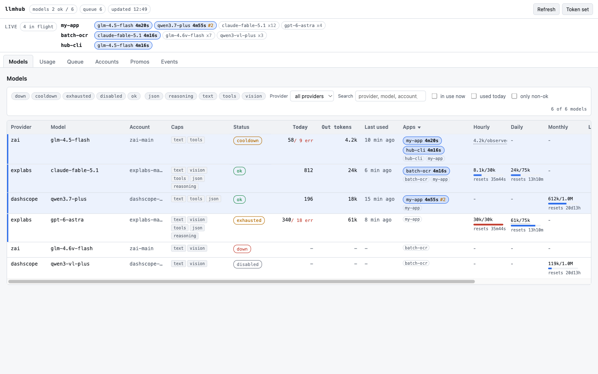 | 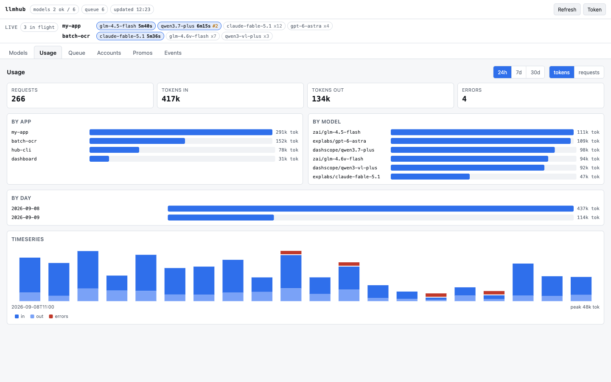 |

| Queue | Accounts - Quick add |
| --- | --- |
| 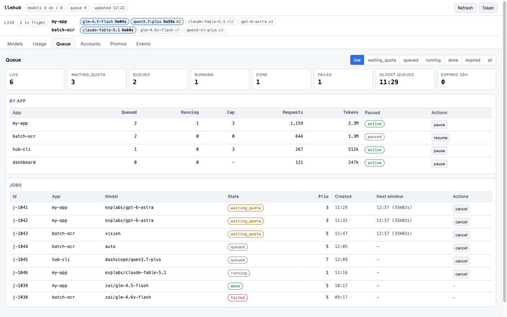 | 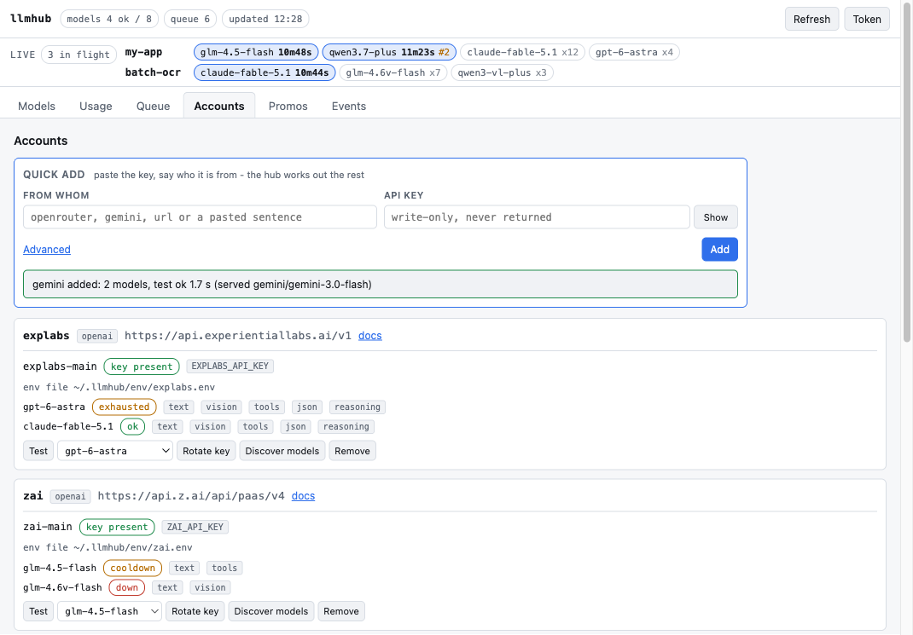 |

| Promos - Add key | Scout box |
| --- | --- |
| 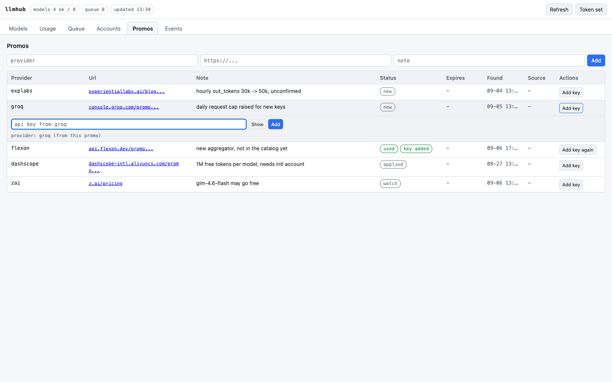 | 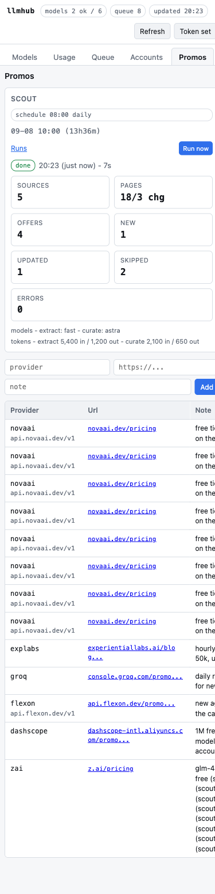 |

| Promos - filters and sort | Promos on a phone |
| --- | --- |
| 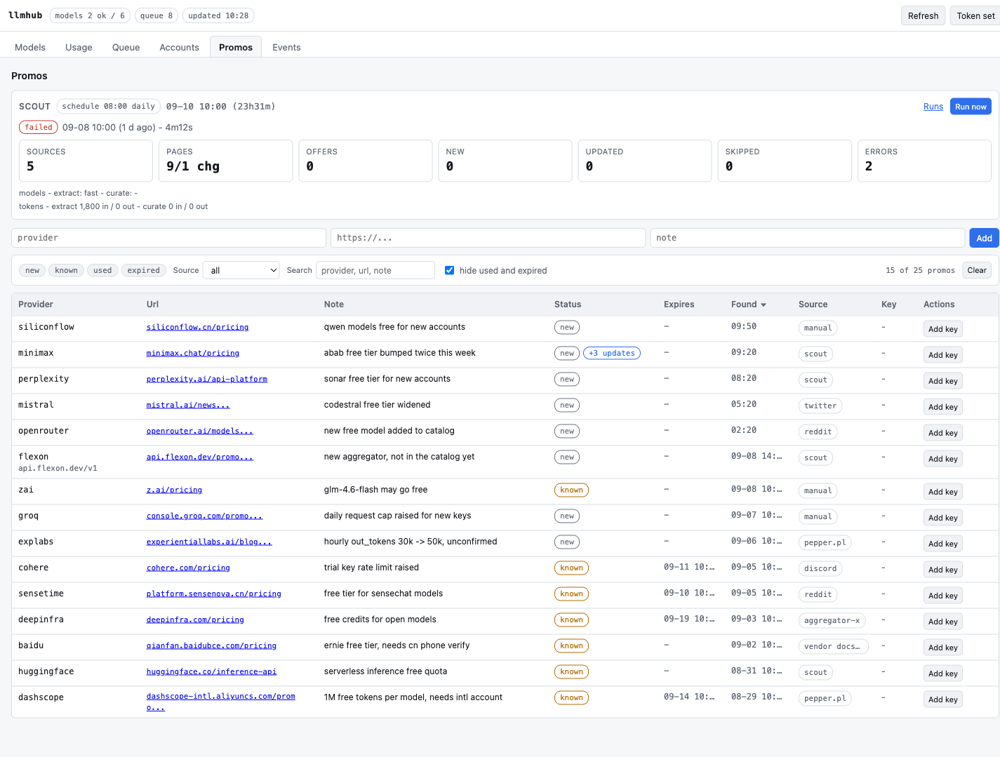 | 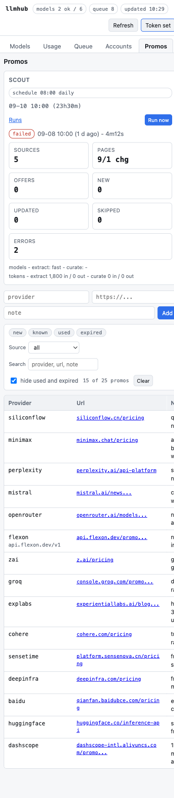 |

| Promos - reject with a reason | Reject form on a phone |
| --- | --- |
| 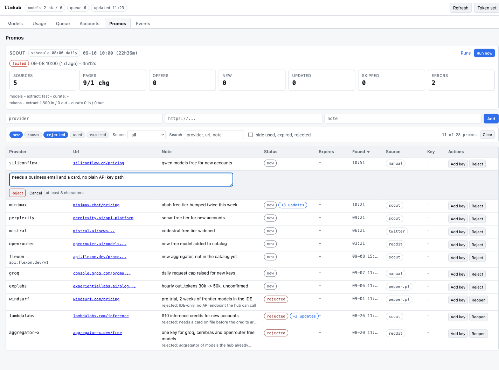 | 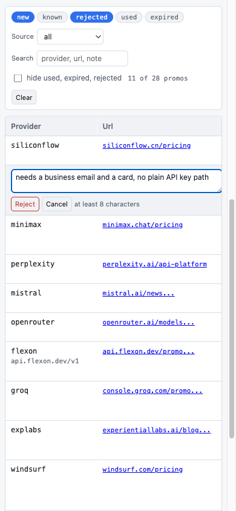 |

| Live strip and the Models apps column | Live strip on a phone |
| --- | --- |
| 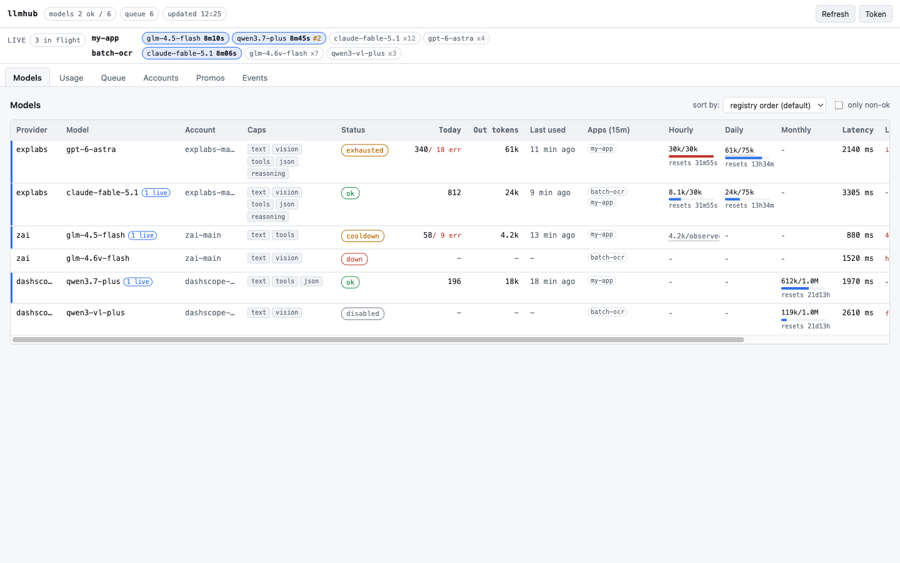 | 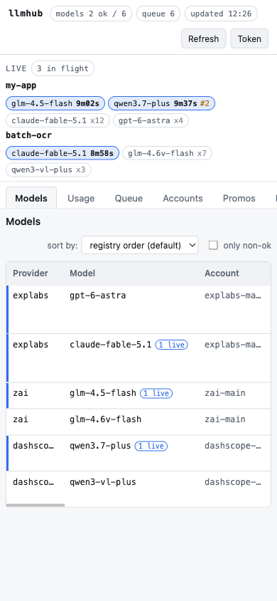 |

| Events - filtered | Mobile (Models tab) |
| --- | --- |
| 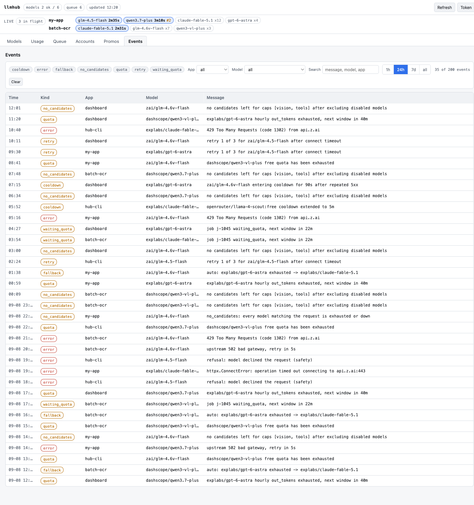 | 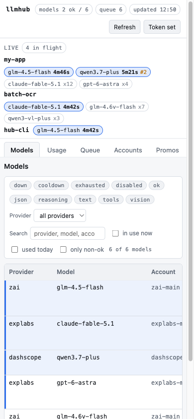 |

## Running as a service

```bash
launchd/install.sh              # install/replace com.llmhub.gateway
launchd/install.sh --uninstall  # remove it
```

Logs land in `~/Library/Logs/llmhub/`. The LaunchAgent execs `.venv/bin/python3 -m llmhub`
from the repo directory - keys still come from `~/.llmhub/env/*.env`, nothing goes in the
plist. `install.sh` runs `uv sync` first, because the job deliberately does not go through
`uv run`: macOS attributes a job's file access to its first program, and neither `/bin/zsh`
(an ungrantable platform binary) nor `uv` can hold the privacy grants an agent CLI needs to
reach its own state directory. Launched through either, a `kind: cli` provider fails with
"operation not permitted".

Caddy, exposing the dashboard at `llmhub.localhost` on the Mac and under a `/hub` prefix
on the LAN:

```
llmhub.localhost {
    reverse_proxy 127.0.0.1:8800
}

mac.local {
    handle_path /hub/* {
        reverse_proxy 127.0.0.1:8800
    }
}
```

LAN calls need `Authorization: Bearer $LLMHUB_TOKEN`; loopback calls do not.

## Configuration reference

Environment variables:

| Variable | Purpose | Default |
| --- | --- | --- |
| `LLMHUB_HOME` | state directory | `~/.llmhub` |
| `LLMHUB_REGISTRY` | path to `providers.yaml` | `$LLMHUB_HOME/providers.yaml` |
| `LLMHUB_DB` | path to `hub.db` | `$LLMHUB_HOME/hub.db` |
| `LLMHUB_ENV_DIR` | directory scanned for `*.env` key files | `~/.llmhub/env` |
| `LLMHUB_TOKEN` | bearer token required off loopback | unset |
| `LLMHUB_JOB_WORKERS` | concurrent job workers | `6` |
| `LLMHUB_JOBS_PER_APP` | hard ceiling of running jobs per app, `0` = none | `0` |
| `LLMHUB_JOBS_PER_APP_MIN` | floor of the per-app fair share | `1` |
| `LLMHUB_JOB_TTL_S` | default job deadline | `21600` (6 h) |
| `LLMHUB_JOB_TTL_MAX_S` | cap on a client-supplied `ttl_s` | `129600` (36 h) |
| `LLMHUB_JOB_LEASE_MARGIN_S` | lease = request timeout + this | `60` |
| `LLMHUB_QUEUE_MAX_PER_APP` | live jobs one app may hold before 429 `queue_full` | `200` |
| `LLMHUB_JOB_RETENTION_DAYS` | how long finished job rows are kept | `7` |
| `LLMHUB_SCOUT_AT` | daily scout run, local `HH:MM`, empty = off | `08:00` |
| `LLMHUB_SCOUT_SOURCES` | path to `scout_sources.yaml` | `$LLMHUB_HOME/scout_sources.yaml` |
| `LLMHUB_BASE_URL` | hub endpoint the scout calls for its own LLM work | `http://127.0.0.1:8800/v1` |
| `BRAVE_SEARCH_API_KEY` | enables Brave web search as a scout source | unset |
| `LLMHUB_SEARXNG_URL` | enables a SearXNG instance as a scout source | unset |

Registry schema (`providers`, `accounts`, `models`, `free` windows, `aliases`) is
documented in full in [`docs/DESIGN.md`](docs/DESIGN.md); `providers.example.yaml` is a
working example to copy from.

## Client integration

[`docs/CLIENT_PROMPT.md`](docs/CLIENT_PROMPT.md) is a paste-in brief for a coding agent
that needs to call the hub instead of a vendor SDK directly: request/response shapes,
headers, the 429/502 error contract, and the async job flow.

Two Claude Code skills ship in `.claude/skills/` and load automatically for any session
started inside this repo: `llmhub-client` (wraps the brief above) and `promo-hunt`
(manual reconnaissance that posts finds to the Promos tab). See
[`docs/SKILLS.md`](docs/SKILLS.md).

## Development

```bash
uv run pytest -q
uv run ruff check .
uv run ruff format --check .
```

Upstream calls are mocked with `respx` - tests run with no network access.

## Status and limitations

- Single user. One bearer token, no per-caller isolation, no accounts or roles.
- Loopback (`127.0.0.1`) is fully open, no auth at all. A LAN caller needs the bearer
  token, and that call still travels as plain HTTP - there is no TLS anywhere in front of
  the hub.
- `kind: anthropic` is not implemented; only `openai`-compatible and `ollama` HTTP
  backends, plus `kind: cli` agent backends, actually run.
- `kind: claude-code` (headless `claude -p` as a job lane) is design-only, not built.
- Streaming responses skip two things the non-streaming path does: the truncated-JSON
  check on `response_format: json` (usage and shape are only known after the stream
  closes) and the `X-Hub-Remaining-Out` header (the same reason).
- Copilot CLI reports no output token count at all - only input tokens plus AI
  credits/premium requests - so `completion_tokens` is always 0 for that vendor.
- Most free tiers publish no quota numbers up front; a model's real cap is unknown until
  the first 429 states one and the hub records it as an observed cap.
- Scout's source list (`~/.llmhub/scout_sources.yaml`) is a hand-kept list of pages and
  feeds, not a discovery mechanism - a new vendor is found only once someone adds its
  page to the list.

## License

MIT, see [LICENSE](LICENSE).
