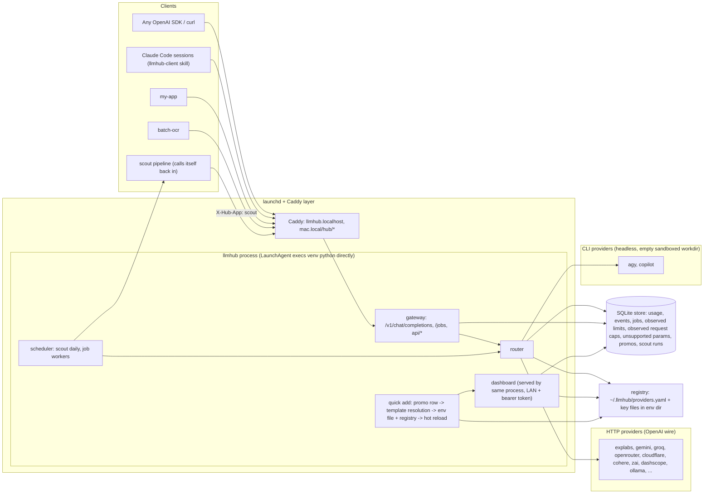
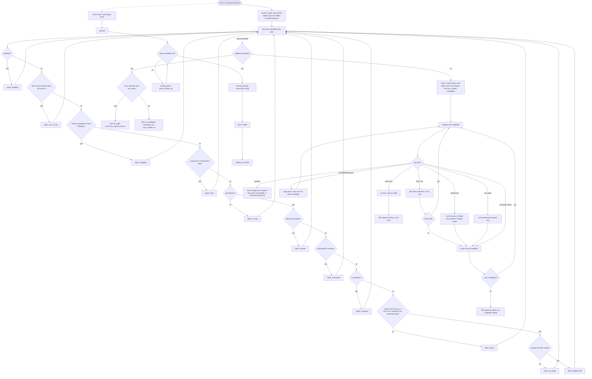
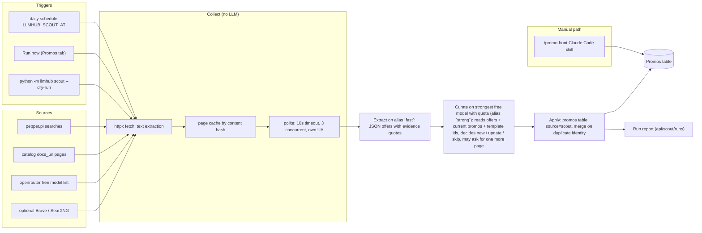

# Architecture

This is a snapshot of the current code, not a design log - see
[DESIGN.md](DESIGN.md) for how each piece got here and what changed along the way.

## System overview

Every caller goes through the same gateway: an OpenAI SDK or curl, a Claude Code
session using the `llmhub-client` skill, another local app, or the scout pipeline
calling back into its own hub with `X-Hub-App: scout`. The gateway hands the
request to the router, which picks a candidate from either an HTTP provider
(OpenAI-compatible wire format) or a CLI provider (an agent CLI run headless in
an empty, sandboxed working directory). State lives in one SQLite database and
one YAML registry; the dashboard and the quick-add flow read and write both
through the same process. A LaunchAgent execs the venv's `python3 -m llmhub`
directly (not through `uv run` or a shell - macOS ties privacy grants to the
first program in the exec chain), and Caddy publishes the dashboard on
`llmhub.localhost` and under `mac.local/hub/*` on the LAN.

## Request lifecycle

`router.select` resolves `model` to a pool (the whole registry for an alias, or
one entry for an explicit `provider/model_id`), then filters that pool in a
fixed order - disabled, opt-in-only (unless the alias names the entry itself),
missing capability (`X-Hub-Require`), paid without `X-Hub-Allow-Paid`, no key,
expired allowance, exhausted window, cooldown, no quota room (against `est_in` /
`est_out` and the declared or observed windows), then a size ceiling check that
produces `too_large` instead of a doomed upstream call. What survives is ordered
by `X-Hub-Prefer`, then the alias's own `prefer`, then LRU rotation across the
top `spread` candidates, so a wide pool actually gets used instead of parking
every call on the first entry. `router.run` then walks that list: a success
writes a usage row and returns `X-Hub-Model` / `X-Hub-Remaining-Out`; a
`429`/`5xx` retries the same candidate on a 5/15/45 s backoff before moving on; a
quota error marks that (account, model) exhausted for the window and moves on;
`too_large` records the observed cap and moves on; an unsupported param is
stripped and the same candidate is retried once; a truncated JSON response (a
`response_format: json` reply that hit `finish_reason: length`) moves on without
retry; an auth error is raised straight to the caller, no fallback. Exhausting
every candidate that was rejected only for `too_large` answers `413`; any other
exhaustion answers `429`; every candidate failing outright answers `502`.

`POST /jobs` runs the same selection asynchronously: a job is `queued`, sits in
`waiting_quota` (with `next_window_at`) while nothing has room - it is never
failed for lack of quota - moves to `running` once a worker slot opens within
its per-app concurrency limit, and ends `done` or `failed`, firing
`callback_url` if one was given.

## Scout pipeline

The scout hunts free-tier offers using the hub's own free models, on a schedule
or on demand, and never sets `X-Hub-Allow-Paid`. Collect fetches every source
with no LLM call at all - pepper.pl searches, every vendor's `docs_url` from the
provider catalog, the OpenRouter free model list, and Brave/SearXNG when
configured - through httpx with a page cache keyed by content hash, so an
unchanged page costs nothing on a second run. Extract runs on the `fast` alias
and turns each changed page into JSON offers with an evidence quote. Curate runs
on the strongest free model that currently has quota (the `strong` alias's own
prefer order, so it moves with the registry instead of a hardcoded list),
reading the offers plus the current promos and the catalog's template ids, and
decides new/update/skip per offer - it can ask for one more page before
deciding. Apply writes to the promos table with `source: scout`, merging on
duplicate identity so a row already marked `used` is never rewritten, and a run
report lands in `api/scout/runs`. The manual `/promo-hunt` Claude Code skill is
a separate path for deeper, human-directed digging; it also posts into promos,
just without the daily automation or the page cache.

